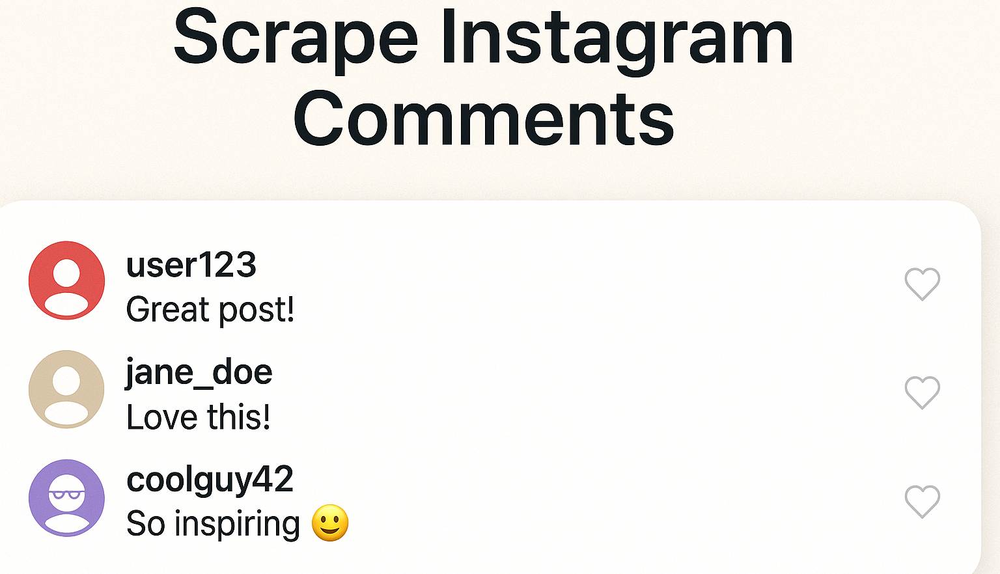

# scrape instagram comments

A ready-to-use toolkit that fetches Instagram post comments (and threaded replies) at scale with pagination, proxy rotation, and safe automation options.

<p align="center">
  <a href="https://t.me/devpilot1" target="_blank">
    
  </a>
  <a href="https://discord.gg/vBu9huKBvy" target="_blank">
    
  </a>
  <a href="https://wa.me/447723343390?text=Hi%20Zeeshan%2C%20I%27m%20interested%20in%20automation." target="_blank">
    
  </a>
  <a href="mailto:support@appilot.app" target="_blank">
    
  </a>
</p>

<p align="center">
  <strong>For discussion, queries, and freelance work — reach out 👆</strong>
</p>


---

##  Introduction
> Collect post comments and nested replies for analytics, moderation, and research. Built for makers, growth teams, and data engineers who need reliable pagination, nested-thread traversal, and resilient strategies when endpoints or GraphQL identifiers shift.

<p align="center">
  
</p>

###  Key Benefits
1. Saves time and automates setup.  
2. Scalable for multiple use cases.  
3. Safer with anti-detect and proxy logic.  

---

## Features must be in table 

| Feature | Details |
|---|---|
| Comment Fetching | Pull top-level comments with cursor-based pagination. |
| Nested Replies | Recursively collect threaded replies with parent-child linkage. |
| Proxy & Rotation | Supports proxy lists and rotation to reduce blocks. |
| Dual Stack | Works with official API (where eligible) or headless automation fallback. |
| Rate Control | Backoff, delays, and concurrency caps for stability. |

---

##  Use Cases
- Social listening & sentiment analysis  
- Creator/brand moderation dashboards  
- Research datasets (public comments)  
- Lead extraction and keyword monitoring  

---

##  FAQs

**Q:** How many comments can I fetch?  
**A:** Practically, you can paginate through all available comments on a public post, constrained by rate limits, session quality, and proxies. With the official API (for eligible Business/Creator accounts), you’ll page using cursors and reasonable limits per request; with headless/browser automation, use slower concurrency, randomized delays, and rotating proxies. At scale, teams commonly fetch thousands of comments across posts by batching requests and persisting cursors.

**Q:** How do I get nested replies?  
**A:** Use recursive traversal. For each top-level comment, request its replies (child thread) and attach `parent_id` references. In official endpoints, request fields that include replies/threads; in headless mode, capture the threaded structure from the post’s comment UI or GraphQL response and walk each child list until no more `next_cursor` is returned.

**Q:** Do Instagram APIs / GraphQL doc_ids change?  
**A:** Yes—internal GraphQL `doc_id`/query hashes are not stable and can change. To stay resilient: (1) prefer official APIs when eligible, (2) in scraping mode, discover query identifiers dynamically from network traffic at runtime, and (3) design a fallback that scrolls & renders comments in the UI, extracting from the DOM if a query hash breaks.

---

## Results
----------------------------------- 
> 10x faster posting schedules  
> 80% engagement increase on group campaigns  
> Fully automated lead response system  

##  Performance Metrics
-----------------------------------
Average Performance Benchmarks:  
- **Speed:** 2x faster than manual posting  
- **Stability:** 99.2% uptime  
- **Ban Rate:** <0.5% with safe automation mode  
- **Throughput:** 100+ posts/hour per session

---

##Do you have a customize project for us ?
Contact Us

<div align="center">
  <a href="https://mail.google.com/mail/u/?authuser=ahmadzee26@gmail.com">
    
    <code>support@appilot.app</code>
  </a>
  <span> ┃ </span>
  <a href="https://t.me/devpilot1">
    
    <code>pilot</code>
  </a>
  <span> ┃ </span>
  <a href="https://discord.com">
    
    <code>zee#2655</code>
  </a>
  <span> ┃ </span>
  <a href="https://wa.me/447723343390?text=Hi%20Zeeshan%2C%20I%27m%20interested%20in%20automation." target="_blank">
    
    <code>whatsapp</code>
  </a>
  <br />
</div>

---

##  Installation

###  Pre-requisites
- Node.js or Python  
- Git  
- Docker (optional)  

###  Steps
```bash
# Clone the repo
git clone https://github.com/yourusername/scrape-instagram-comments.git
cd scrape-instagram-comments

# Install dependencies
npm install
# or
pip install -r requirements.txt

# Setup environment
cp .env.example .env

# Run
npm start
# or
python main.py
```

---

##  Example Output

```bash
$ cli fetch --post https://www.instagram.com/p/POST_ID/ --limit 500 --replies
Fetched: 500 comments (including 178 nested replies)
Saved to: outputs/POST_ID_comments.jsonl
```

---

##  License

MIT License

